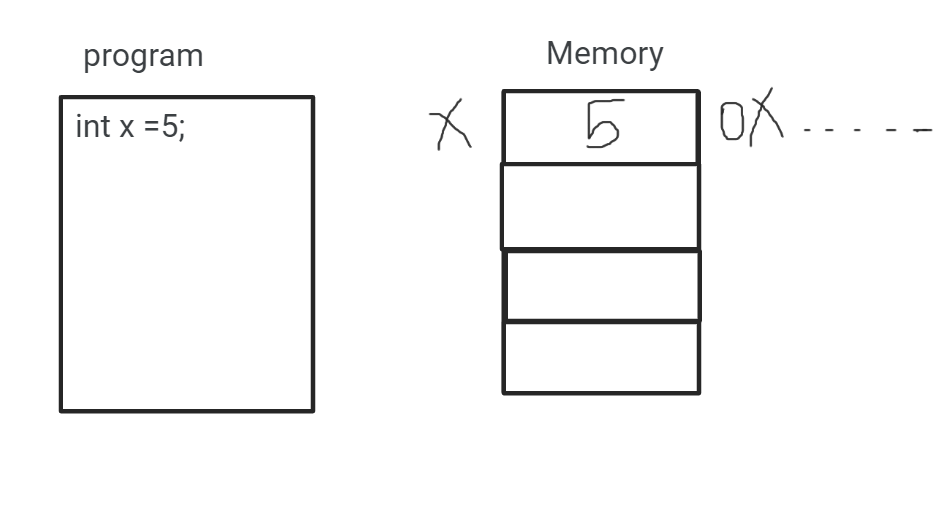
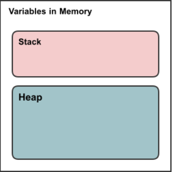
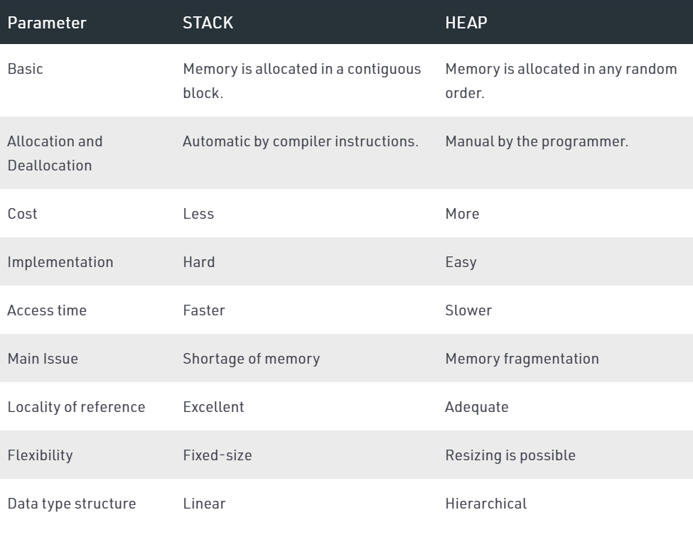

## Tabel Of Content
- [Increment and decrement operators](#I/D)
- [Pointer Declaratrion And Assigning ](#pointers)
  * [The memory Model](#The-memory-model)
  * [Pointers Applications in C++](#pointers-applications)
  * [Pointers And Arrays](#pointersandarrays)
    + [ Array name used as a pointer](#array-name-used-as-a-pointer)
    + [ Passing Arrays to Functions](#array-pass-to-function)
    
- [Passing Arguments To Function](#pass-arg)
  * [Pass by value](#pass-v)
  * [Pass by pointer](#pass-p)
  * [Pass by reference](#pass-r)
  * [Pass by pointer reference](#pass-pr)


# Increment and decrement operators <a name="I/D"></a>
the increment operator ++ increases the value of a variable by 1. Similarly, the decrement operator -- decreases the value of a variable by 1.
They can be used as prefix or postfix.
* [Example:](#sub-heading-1)

```c++
int a = 3;
a++ // a increases by one, so a = 4
a-- // a decreases by one, so a = 3
};
```

- [diffrence between prefix and postfix](#sub-heading-1)

  * if we use ++ as a prefix (++a), the value of a is incremented by 1 then used.

  * if we use ++ as a postfix (a++), the value of a is used first then incremented by 1.

  * The same goes for decrement operator (--)
* [Example:](#sub-heading-1)

```c++
#include <iostream>

using namespace std;

int main() {
   int var1 = 5, var2 = 5;

   // var1 is displayed
   // Then, var1 is increased to 6.
   cout << var1++ << endl;

   // var2 is increased to 6
   // Then, it is displayed.
   cout << ++var2 << endl;

   return 0;
}
};
```
* [Try to solve Example:](#sub-heading-1)

```c++
#include <iostream>

using namespace std;


int func(int a,int b,int c){
int sum = ++a + b-- - c;
return sum;

}
int main() {
   int x = 5, y =3;
   
   int sum = (x++) + y + x; // sum = ?
   cout<<x<<endl; // value of x printed on screen = ?

   int sum_2 = (++y) + x; // sum_2 = ? 
   cout<<y<<endl; //value of y printed on screen = ?

   cout<<y--<<endl; // value of y printed on screen = ?
   cout<<y<<endl; // value of y printed on screen = ?

int k = 10; int l =5; int m = 2;
int result = func(k++,--l,m);

cout<<result<<endl; // value of result printed on the screen ?

   return 0;
}
};
```

# Pointers <a name="pointers"></a>

> Pointers are variables that store the memory addresses of other variables. For any `variable` we can have its address by `&variable`.


```c++
#include <iostream>
using namespace std;

int main()
{
    // declare variable
    int var1 = 3;
    int var2 = 5;


    // print address of var1
    cout << "Address of var1: "<< &var1 << endl;
    / print address of var2
    cout << "Address of var2: "<< &var2 << endl;

}
```
You will see an output that begin with `0x` which indicate the address of the variable in the memory. 
**notice:** `int` variable has a size of 4 byte in a 64-bit operating system.  


## Pointer Declaratrion And Assigning
```c++
// pointer declaration
int* ptr;
// or int *ptr
  
// assigning address to pointer
int* ptr; int var;
var = 10;
ptr = &var;

//accessing the value of the ptr (also called dereferencing)
cout<<"ptr:"<<ptr<<"   address of var: "<<&var<<endl;
cout<< "(*ptr):" <<*ptr << endl;   // output: 10

//changing value pointed by the pointer
*ptr = 5;
cout << "var:"<< var << endl;      // output: 5
```
**notice:** 
* we used `*` after the data type to declare a pointer.
* `var` is not a pointer.
* we stored `var` address into `ptr`.
* we used `*` **dereference operator** to print the value stored in this address.
* we can change the `var` content by working with pointers. 

> *note* `*ptr`  has a value and `&var` is an address so we cannot write `*ptr = &var`.

>  `ptr` is an address and `var` has a value so we cannot write `ptr = var`
___

# The memory model
> everything in our program is stored in the memory of our machine. lets have a peak on what happens on the memory when we try to declare a variable.

 

>  the memory in the machine can be devided into 2 places called the `stack` and the `heap`, each of them has its advantages and disadvantages. lets dive into some details.


## The stack
> so far, all the variables we declared was stored ( allocated) on this part of the memory.
```c++
int x =5; 
bool y = true;
// these are allocated on the stack

```
> the stack also stores functions. whenever we make a function call, a space on the stack is allocated for this function, this space is called a stack frame.  the stack stores these functions in a `LIFO` manner (Last in first out), so if we call a function , then call another function inside it, the latter gets executed when it's called, and when it's done, the stack continues the first function. 

### Advantages and disadvantages of stack:
> the stack has `automatic` memory managment, which means it automatically deletes variables when they go out of scope, so,  A programmer does not have to worry about memory allocation and deallocation of stack variables. additionally, The allocation happens on `contiguous` blocks of memory, which makes the access time `faster`. 
___
>disadvantages of stack is that its memory is `limited`. and we `can not change the size of an array` that is on the stack while the program is `running`.

## The heap
> the heap (also called the free store) is a part of the memory accessible only using pointers. to allocate memory on the heap we use the `new` operator. 
### Advantages and disadvantages of heap:
>advantages: the heap can offer `more memory` than the stack. we `can specify the size of arrays` on the heap while the program is `running`.
---
>disadvantages: the heap memory allocation must be done `manually`, which may cause memory leaks. the allocation happens `randomly` in any place of the heap.



## Pointers Applications in C++ <a name="pointers-applications"></a>
1. ### dynamic memory allocation
pointers are the only way we can allocate memory on the heap (the free store). we can do this using the `new` operator. 

```c++
#include <iostream> 
using namespace std; 
  

int main() 
{ //example 1
   int *int_ptr = nullptr;
   cout<<int_ptr<<endl;
   int_ptr = new int (5);
   cout<<int_ptr<<endl;
   cout<<*int_ptr<<endl;

  delete int_ptr; // what is the delete operator?

  //example 2
  double * ptrToArray = new double [15];
  //manipulate the values stored in the array the pointer is pointing to:

   ptrToArray[0]=6;
   ptrToArray[1]=8;

  cout<<*ptrToArray<<endl;
  cout<<*(ptrToArray+1)<<endl;
  cout<<ptrToArray[1]<<endl;
  cout<<ptrToArray[9]<<endl;

  delete [] ptrToArray;
// number of delete must be = number of new.
} 
```


1.  Passing arguments by reference to modify variable of function in other(e.g. swap two variables)\
or  For efficiency purpose (passing large structure without reference would create a copy of the structure which will waste storage)

```c++
#include <iostream> 
using namespace std; 
  
void swap(int* x, int* y) 
{ 
    int temp = *x; 
    *x = *y; 
    *y = temp; 
} 
  
int main() 
{ 
    int x = 10, y = 20; 
    swap(&x, &y); 
    cout << x << " " << y << endl; 
    return 0; 
} 
```
2. Accessing array elements. Compiler internally uses pointers to access array elements.
3. To return multiple values (e.g. returning square and square root of numbers or returning an array)
4. Dynamic memory allocation : We can use pointers to dynamically allocate memory. The advantage of dynamically allocated memory is, it is not deleted until we explicitly delete it.

> There are a lot of other applications for pointers, but we will not cover it in this course.


```c++
// C++ program to dynamically allocate an array of given size. 
#include <iostream> 
using namespace std; 
  
int* createArr(int n) 
{ 
    return new int[n]; 
} 
  
int main() 
{ 
    int* pt = createArr(10); 
    return 0; 
} 
```


## Pointers And Arrays <a name="pointersandarrays"></a>
Pointers can store address of cells of an array. Array is a static pointer.
```c++
int *ptr;
int arr[4] = {1, 2, 3, 4};
 // address of the first element of the array is stored in the pointer ptr
ptr = arr;  // or ptr = &arr[0];
```
Here the pointer points to the address of the first element of the array.


**Navigation through the array using pointers**
```c++
int *ptr;
int arr[4] = {1, 2, 3, 4};
ptr = arr;
// printing address of array elements using pointers
 for (int i = 0; i < 4; ++i)
 {
    cout<< "ptr + " << i << "=" << ptr + i << endl;
    //printing address of array elements 
    // cout<< "&arr[" << i << "] = " << &arr[i] << endl;
 }
 
 
 // printing values of array elements using pointers
 for (int i = 0; i < 4; ++i)
 {
    cout<< "*(ptr + " << i << " ) =" << *(ptr + i) << endl;
    //printing values of array elements 
    // cout<< "arr[" << i << "] = " << arr[i] << endl;
}

cout << arr << endl;
cout << arr +1 << endl;
cout << *arr << endl;
cout << *arr+1 << endl;
cout << *(arr+1) << endl;

```

> If we initialize `ptr  = &arr[1]` we will have 
>
> ptr - 1  is same as &arr[0]
>
> ptr + 1  is same as &arr[2]
>
> ptr + 2  is same as &arr[3]


## Array name used as a pointer <a name="array-name-used-as-a-pointer"></a>
```c++
#include <iostream>
using namespace std;

int main() {
    int arr[5];
    
   // Insert data using pointer notation
    cout << "Enter 5 numbers: ";
    for (int i = 0; i < 5; ++i) 
    {
        // store input number in arr[i]
        cin >> *(arr + i) ;
    }

    // printing data using pointer notation
    cout << "Array elements: " << endl;
    for (int i = 0; i < 5; ++i) 
    {
        // print value of arr[i] 
        cout << *(arr + i) << endl ; 
        // *(arr++) will give an error as it mean changing the array address which is the first element 
        // *(ptr++)  is normal operation 
        
    }
    return 0;
}
```
**notice** we did not declare a pointer, but instead we used the array name for the pointer notation.\
To see what is wrong with arr++ we use a simplified example:
```c++
int a = 0;
cout << a+1 << endl; // output: 1 but a is still holding value of 0 in the memory
cout << a++ << endl; // output: 1 but a now hold a value 1 in the memory  
```

## Passing Array to Function <a name="array-pass-to-function"></a>
C++ does not allow to pass an entire array as an argument to a function. However, You can pass a pointer to an array by specifying the array's name without an index.\
If you want to pass a single-dimension array as an argument in a function, you would have to declare the function in one of following three ways and all three declaration methods produce similar results because each tells the compiler that an **integer pointer** is going to be received.
> void Fun(int *arr) { ..... }       // as a pointer 

> void Fun(int arr[10]) { ..... }   // as sized array

> void Fun(int arr[]) { ..... }    // as unsized array


```c++
#include <iostream>
using namespace std;
 
double getAverage(int arr[], int size) {
  int i, sum = 0;       
  double avg;          

   for (i = 0; i < size; ++i) {
      sum += arr[i];
   }
   avg = double(sum) / size;

   return avg;
}

int main () {
   // an int array with 5 elements.
   int balance[5] = {1000, 2, 3, 17, 50};
   double avg;

   // pass pointer to the array as an argument.
   avg = getAverage( balance, 5 ) ;
 
   // output the returned value 
   cout << "Average value is: " << avg << endl; 
    
   return 0;
}
```
## Passing Arguments To Function <a name="pass-arg"></a>

We can pass actual value to the function, pass the address of the value, or passing a reference to the function. Each has a different methadology and application.
```c++
int var1 = 5;
int var2 = 10
int *ptr;
ptr = &var1;   // pointer has the address of var1
int &ref = var1;  // now var1 and ref has the same address 
ptr = &var2;  // pointer addres can follow each variable it is assigned to, but refrence are assigned to 
one variable only
```

### Pass by value <a name="pass-v"></a>
We pass a copy of the value when we did not want to change the actual value of the variable 
```c++
void passByVal(int val)
{
  val = 10;
  cout<< "val = " << val;
}
int main()
{
 int x = 5;
 cout<< "x = "<< x << endl; //5
 passByVal(x);
 cout<< "x = "<< x << endl; //5
 
 }
```

### Pass by pointer <a name="pass-p"></a>
we are passing the address of the variable.
```c++
void passByPtr(int *ptr)
{
  *ptr = 20;
  cout<< "*ptr = " << *ptr;
  int main()
{
 int x = 5;
 cout<< "x = "<< x << endl; //5
 passByPtr(&x); //20
 cout<< "x = "<< x << endl; //20
 
}
```


### Pass by reference <a name="pass-r"></a>
we pass the actual value of the variable.\
**pass by refrence VS pass by pointer**\
References are usually preferred over pointers whenever we don’t need “reseating”.\
**Use references when you can, and pointers when you have to.**\
A refrence is same object with a different name. Reference must refere to an object and cannot be NULL so it is safer to use.
* pointers can be re-assigned, reference cannot.
* pointers can be null(**a constant with a value of zero** ). It is a good practice to initiallize a pointer as null.
* pointers can iterate over an array.
* pointer is a variable that hold memory address, reference has the same memory as the object .
* pointers need to be dereferenced to acces the memory while the reference can be used directly. 


```c++
void passByRef(int &ref)
{
  ref = 30;
  cout<< "ref = " << ref;
 }
  int main()
{
 int x = 5;
 cout<< "x = "<< x << endl; //5
 passByRef(x); //30
 cout<< "x = "<< x << endl; //30

}
```
<!--
### Pass by  pointer reference <a name="pass-pr"></a>
we are making a reference to the pointer. Thus we want to modify the pointer without modifying the object that the pointer is pointing to. 
```c++
int n1 = 1;
int n2 = 2;
int* p2;
void passByPtr(int *ptr);
void passByPtrRef(int *&ptrRef);
int main(){
int* p1 = &n1;
p2 = &n2;
passByPtr(&n1);
passByPtrRef(p1);
return 0;
}
void passByPtr(int *p1)
{
 *ptr= 3;
 ptr= p2;
 *ptr = 4;
 cout<< "pass by pointer"<< endl;
}

void passByPtrRef(int *&ptrRef)
{
 *ptrRef = 5;
 ptrRef = p2;
 *ptrRef = 6;
 cout<< "pass by pointer reference"<< endl;
 }
```
here 
-->

### About
This session is prepared and managed by **Mohamed Ahmed Abdelaziz** and **Ammar Elsaied**.\
Having trouble with Pages? Contact Us [Mohamed.ahmed997@eng-st.cu.edu.eg](Mohamed.ahmed997@eng-st.cu.edu.eg) [Mohamed.ahmed997@eng-st.cu.edu.eg](Mohamed.ahmed997@eng-st.cu.edu.eg) and We will help you sort it out.
